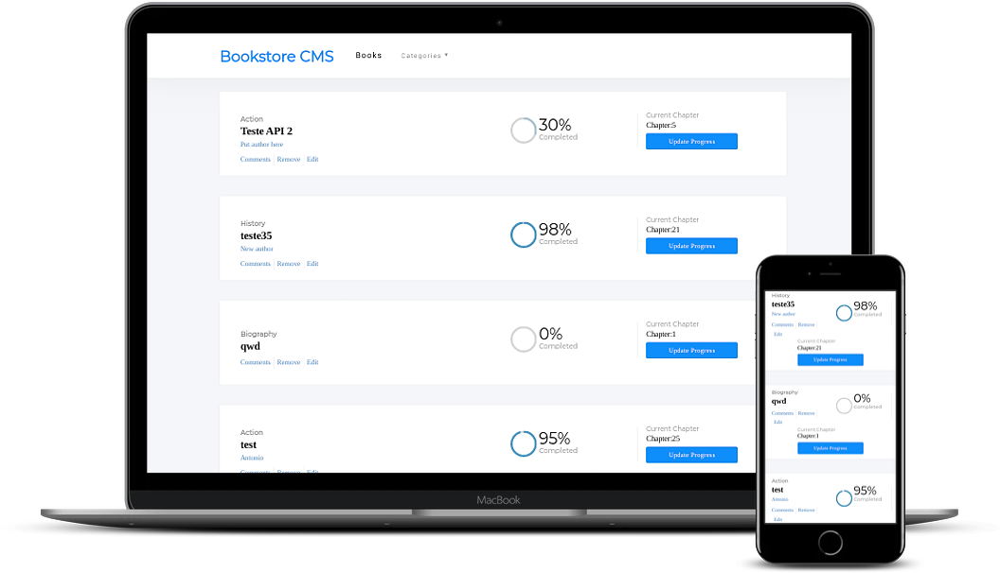

# Bookstore App

An app that allow users to add books and update their reading progress. The purpose of the entire project is to work with a full-stack ( ruby on rails and react).

On a new version it will fetch the books from goodreads.

## Built With

- Javascript
- React
- React-redux
- React-router
- npm
- Ruby on Rails
- CSS
- Html

## Getting Started

Open the [Live Demo Link](https://antonioreact-bookstore.herokuapp.com/) .

## Author

👤 António Fernandes

[Github](https://github.com/trox115) | [Twitter](https://twitter.com/rock_67) | [LinkedIn](https://www.linkedin.com/in/antoniomfernandes/) | [Email](mailto:email@antoniofernandes.com) | [Portfolio](https://www.antoniofernandes.com/)

## 🤝 Contributing

Contributions, issues and feature requests are welcome!

Feel free to check the issues page.

Future Features:
- [ ] Implement Transitions.
- [ ] Add a spinner for dead times in API Call.
- [ ] Get books from goodreads.
- [ ] Add user register.
- [ ] Add user login.

- Transitions.
- Improve UI/UX
- Add spinner for API calls

## Show your support

Give a star ⭐️ if you like this project!

## Booking App Features

To view the live demo click the [link](https://antonioreact-bookstore.herokuapp.com/) and you will fetch books from an API.



# Running Guide

to get a running version of this project on your machine you have to install node and then follow the instructions, for installing Node go to the [node Oficial site https://nodejs.org/](https://nodejs.org/) and follow the installation instructions

```Shell
your@pc:~$ git clone https://github.com/trox115/bookstore.git
your@pc:~$ cd bookstore
your@pc:~$ npm install
your@pc:~$ npm start

```

then you are prompted to your browser to [http://localhost:3000/](http://localhost:3000/)

### Warning: This will only work locally if you download the API

Get it [here](https://github.com/trox115/bookstoreApi)

# About This Project

This project was bootstrapped with [Create React App](https://github.com/facebook/create-react-app).

## Available Scripts

In the project directory, you can run:

### `npm start`

Runs the app in the development mode.<br />
Open [http://localhost:3000](http://localhost:3000) to view it in the browser.

The page will reload if you make edits.<br />
You will also see any lint errors in the console.

### `npm test`

Launches the test runner in the interactive watch mode.<br />
See the section about [running tests](https://facebook.github.io/create-react-app/docs/running-tests) for more information.

### `npm run build`

Builds the app for production to the `build` folder.<br />
It correctly bundles React in production mode and optimizes the build for the best performance.

The build is minified and the filenames include the hashes.<br />
Your app is ready to be deployed!

See the section about [deployment](https://facebook.github.io/create-react-app/docs/deployment) for more information.

### `npm run eject`

**Note: this is a one-way operation. Once you `eject`, you can’t go back!**

If you aren’t satisfied with the build tool and configuration choices, you can `eject` at any time. This command will remove the single build dependency from your project.

Instead, it will copy all the configuration files and the transitive dependencies (Webpack, Babel, ESLint, etc) right into your project so you have full control over them. All of the commands except `eject` will still work, but they will point to the copied scripts so you can tweak them. At this point you’re on your own.

You don’t have to ever use `eject`. The curated feature set is suitable for small and middle deployments, and you shouldn’t feel obligated to use this feature. However we understand that this tool wouldn’t be useful if you couldn’t customize it when you are ready for it.

## Learn More

You can learn more in the [Create React App documentation](https://facebook.github.io/create-react-app/docs/getting-started).

To learn React, check out the [React documentation](https://reactjs.org/).

### License

This project is MIT licensed.
